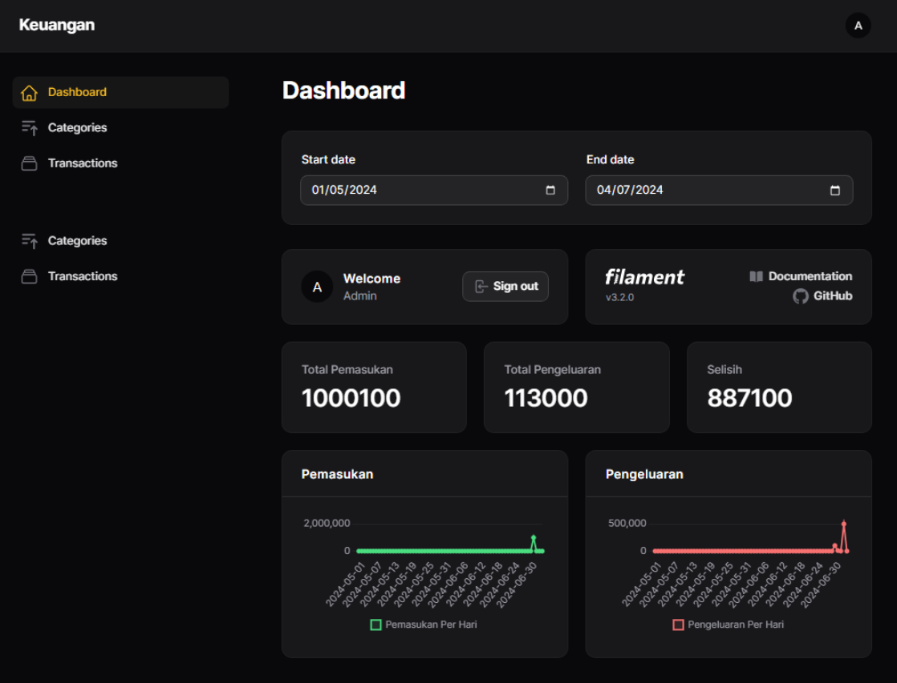

## Website Keuangan

Website keuangan adalah website untuk manajemen pemasukan dan pengeluaran menggunakan Laravel dengan teknologi sebagai berikut:

- [Laravel 10](https://laravel.com/docs/10.x/releases).
- [Laravel Filament 3](https://filamentphp.com/docs/3.x/panels/installation) yang sudah terdapat Tailwind CSS di dalamnya.
- [Laravel Trend](https://github.com/Flowframe/laravel-trend).

## Level User

- Admin

## Fitur

- Halaman Login
- Menu Logout
- Menu Dashboard
- Manajemen Kategori (CRUD)
- Manajemen Transaksi (CRUD)
